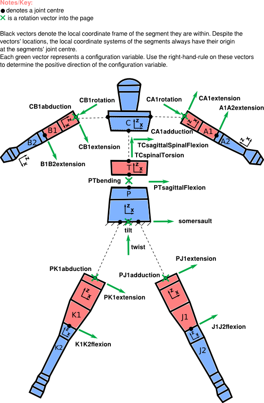

.. _configuration:

Configuration
=============
The configuration of the human is set by 21 joint angles. The image below
describes all the joints and the joint angles between the segments of the
human.

There are two ways to provide the configuration to the package:

 - A configuration text file, such as *CFGtemplate.txt* in misc/, or
   :download:`here <../misc/CFGtemplate.txt>`. This file follows `YAML`_ syntax.
 - A dictionary with the correct keys to the constructor of
   :py:class:`yeadon.human.Human`. The keys are exactly as written in the image
   below. One can also access the :py:attr:`yeadon.human.Human.CFG` variable to
   see what the dictionary looks like.

Frames
------
Here, we use the term `frame` to mean a coordinate system: something with an
origin and orientation (sometimes a frame does not include an origin, and is
just a vector basis).

The **global frame** is located at the bottom center of the pelvis stadium,
``Ls0``. The :math:`x` and :math:`z` axes are in a frontal plane, with the
:math:`x` axis directed to the left and the :math:`z` axis oriented superiorly.
The :math:`y` axis is directed in the posterior direction.

Each segment has its own frame. The origins of the segment frames are denoted
by the black dots, and are at the location of a joint center between two
segments.  Solids have their own frame as well, which share the same
orientation of the segment containing them, but are shifted along the
longitudinal (:math:`z`) axis of the segment.

Each segment is rotated relative to its parent segment through body fixed
x-y-z rotations (x-y-z Euler angles) as specified in M. R. Yeadon, “The
simulation of aerial movement--i. The determination of orientation angles from
film data.,” Journal of biomechanics, vol. 23, no. 1, pp. 59–66, Jan. 1990.

Location of joint centers
-------------------------
Here is a description of the points at which segments are connected to each
other (that is, the location of joint centers):

 - The joint centers for the legs, for segments J1 and K1, are located at
   :math:`(t,0,0)` and :math:`(-t,0,0)` in the frame of the ``s0`` solid,
   respectively, where :math:`t` is the thickness of the ``Ls0`` stadium (see
   :ref:`measurements` for solid/stadium labels).
 - The joint centers of the arms are at the Ls4 level, at the midpoint of the
   semicircular arcs of the Ls4 stadium.
 - The two joint centers in the torso are centered along the z-axis of the
   stadia.

.. _YAML: http://www.yaml.org
