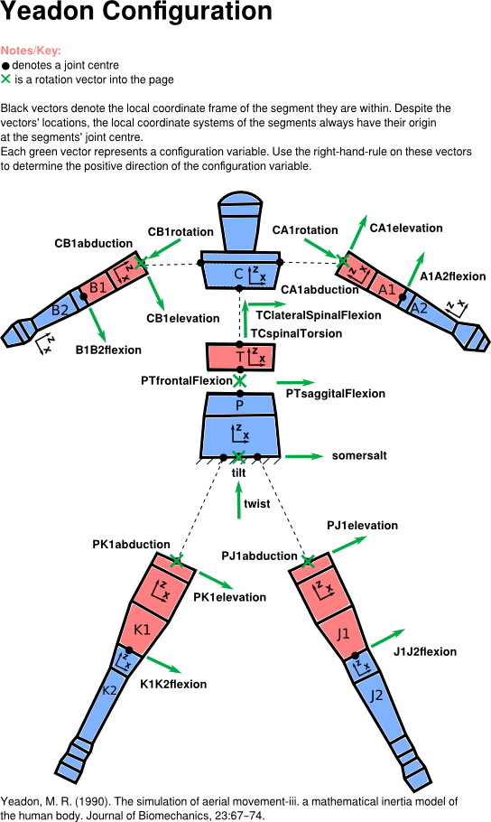

Configuration
=============
The configuration of the human is set by 21 joint angles. The image below
describes all the joints and the joint angles between the segments of the
human.

There are two ways to provide the configuration to the package. Both are valid
CFG arguments when creating a human object.

 - A configuration .txt file, such as CFGtemplate.txt in yeadon/, or
   :download:`here <../CFGtemplate.txt>`.
 - Provide a dictionary with the correct keys. The keys are exactly as written
   in the image below. One can also access the yeadon.human.CFG variable to see
   what the dictionary looks like.

Location of joint centres
-------------------------
 - The joint centres for the legs, for segments J1 and K1, are located at
   (t,0,0) and (-t,0,0) in the coordinate frame of the ``s0`` solid,
   respectively.
 - The joint centres of the arms are at the Ls4 level, centered
   anterior-posterior (front-back), and at the edges of the semicircular
   portion of the Ls4 stadium.
 - The two joint centres in the torso are centered along the torso.

