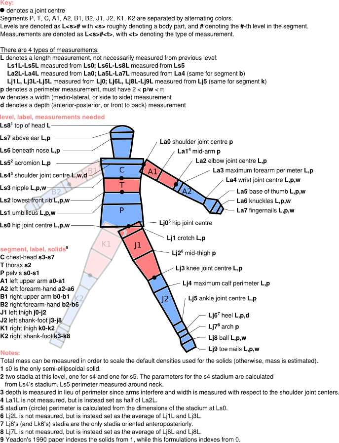

.. _measurements:

Measurements
============

Here we describe the measurements that need to be taken to define a human with
this model, and we provide some guidance for taking those measurements and
getting them into the code.

The stadium shape and the stadium solid
---------------------------------------

The human is composed of 11 rigid body segments. Each segment is defined as a
loft across a number of 2D parallel stadium shapes, which are defined below. In
one case, a segment contains a semi-ellipsoid solid. The model is customized to
an individual via 95 anthropomorphic measurements to define the stadia and the
distances between them.

A *stadium* shape, show in the figure below, can be defined via any of the
following 4 sets of 2 parameters:

 - a radius :math:`r` and thickness :math:`t`,
 - a perimeter :math:`p` and width :math:`w` along the stadium's longitudinal
   axis
 - a perimeter :math:`p` and a depth :math:`d = 2r`.
 - a depth :math:`d` and a width :math:`w`.

.. image:: stadium.png

A circle can be defined by a stadium whose thickness is zero, :math:`t = 0`.

*Stadium solids* are defined by two parallel stadia, as well as the height
:math:`h` of the solid between the two stadia (i.e., a loft between the two
stadium cross sections).

Specification of all measurements
---------------------------------

The figure below specifies all 95 measurements.

To define the stadium solids that make up the human model, one takes the
measurements outlined here. The measurements consist of *lengths* :math:`L`
(different from heights), perimeters :math:`p`, widths :math:`w`, and depths
:math:`d`.

By measuring the parameters that define the stadia (also called *levels*), and
the distance between these stadia, we define 39 stadium solids. Each stadium is
shared by two stadium solids, except for the stadia at the end of the hands and
feet. In general, the stadia are defined by measuring perimeter and width,
since these are easier to measure. There are a few exceptions
though, and these are described further down the page.

It is lengths, not heights, that you measure off the subjects. That is, the
length measurements are sums of heights, not the individual heights of the
stadium solids. For example, The "length" for the Ls5 acromion level
is measured from Ls0, the hip joint centre, not from Ls4. The figure above
lists the level from which the length for other levels are measured.

Scaling densities via a measured mass
-------------------------------------
The mass of the model is estimated from the measurements described above, along
with densities for the various segments taken from the literature. In the case
that you also measure the mass of the individual being modeled, it is possible
to scale the densities so that the total mass of the human is that which you
have measured. See :ref:`usage` for a brief explanation on how to do this.

Exceptions to the general measurement practice
----------------------------------------------
There are a number of exceptions to the general scheme of measurements required
by the model.

 - **Length exceptions**: Lengths to arm level 1 and leg levels 2 and 7 are not
   measured. The length from La0 to La1 (or Lb0 to Lb2) is set internally
   as half the length from La0 to La2 (or Lb0 to Lb2). The lengths to leg
   levels 2 and 7 are calculated as averages of the two lengths around leg
   levels 2 and 7.  Thus, perimeters, etc. at these levels should be measured
   halfway between the surrounding levels (i.e., perimeter of the La1 stadium
   is measured at the point in in the arm halfway between La0 and La2).
 - **Levels that are circles** (zero-thickness stadia): Arm levels 0-3 (the
   first four arm levels) and leg levels 0-5 and 7 (the first six and the
   arch). For these, only a perimeter measurement is required (no width or
   depth is measured).
 - **Depth measurements**: As far as measurements are concerned, the only
   difference between a depth and a width is that a depth is measured anterior
   to posterior (front to back), while widths are measured medio-laterally
   (side to side) when the subject is in the configuration as drawn in the
   diagram above. Depths are measured at the Ls5 acromion, and the Lj6, Lk6
   heel.
 - **The neck**: The base of the neck, which is also located at level Ls5,
   acromion, is modeled as circular. Its radius is set internally from
   the acromion perimeter measurement. This means that the acromion perimeter
   should be measured about the base of the neck.

Getting measurements into the model
-----------------------------------
There are two options for getting measurements into the model:

 - Use the `meastemplate.txt` input text file in the misc/ directory, or
   :download:`here <../misc/meastemplate.txt>`, to define all measurements. The
   file uses the `YAML`_ syntax. This syntax allows you  to treat the input
   file as a Python script in which you simply define a number of variables.
   See comments within the file for further details.
 - Provide a python dictionary, containing all the appropriate
   fields, to the :py:class:`yeadon.human.Human` constructor. You can obtain a
   sample dictionary from the variable :py:attr:`yeadon.human.Human.meas`. The
   keys for the dictionary are the names of the variables in the
   `meastemplate.txt` file, as strings.

Internally, the package uses units of meters for the measurements. However, it
may be that you have worked with different units in gathering the measurements.
In the case that you are using an input text file to specify measurements
(i.e., `meastemplate.txt`), you can define the measurements using the units you
desire, and the package will perform the unit conversion for you. This is done
by providing a value for the variable ``measurementconversionfactor`` in the
text file, as shown in `meastemplate.txt`. This is a number that converts the
units of your measurements into meters. For example, if you took measurements
in millimeters, you should give this variable the value 0.001. If you are
providing measurements via a dictionary, the measurements must be in units of
meters.

Sample measurement files
------------------------
Here are measurement data files for three people we measured:
 - :download:`male1 <../misc/samplemeasurements/male1.txt>`
 - :download:`male2 <../misc/samplemeasurements/male2.txt>`
 - :download:`male3 <../misc/samplemeasurements/male3.txt>`
 - :download:`female1 <../misc/samplemeasurements/female1.txt>`

.. _YAML: http://www.yaml.org/
