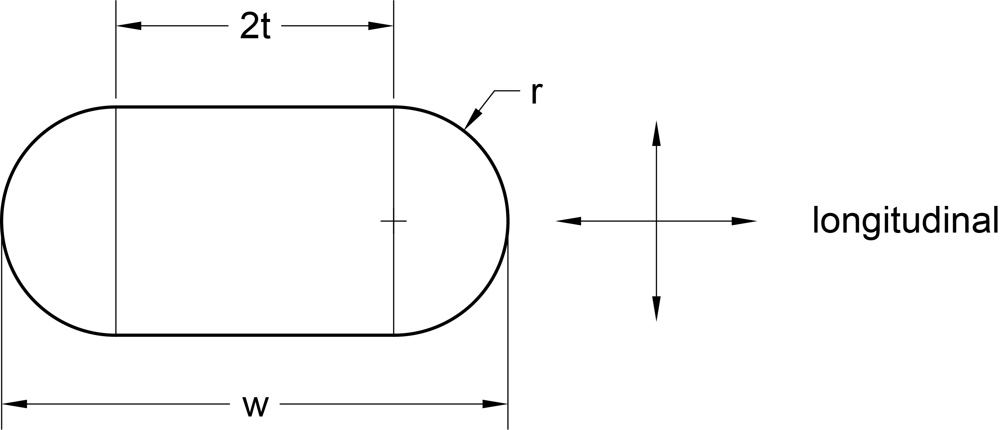
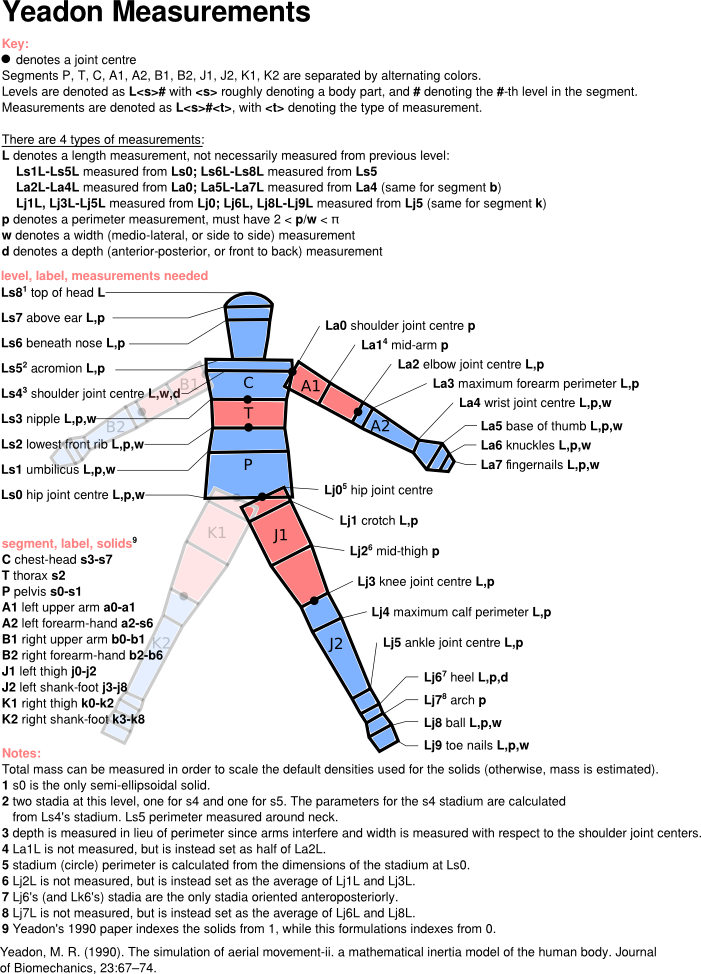

Measurements
============

This document describes the measurements that need to be taken, and provides
some guidance for taking those measurements and getting them into the code.

There are 95 measurements to take that aid with the definition of 39 stadia, 39
stadium solids, and one semi-ellipsoid.

*Stadia* can be defined by either
 * a radius :math:`r` and thickness :math:`t`,
 * a perimeter :math:`p` and width :math:`w` along the stadium's longitudinal
   axis
 * a perimeter :math:`p` and a depth :math:`d = 2r`.
 * a depth :math:`d` and a width :math:`w`.

A circle can be defined by a stadium solid whose thickness is zero, :math:`t = 0`.

*Stadium solids* are defined by two stadia, as well as the height :math:`h` of
the solid between the two stadia.

To define the stadium solids that compose the human model, one can take the
measurements outlined here. The measurements consist of *lengths* :math:`L` (not
heights), perimeters :math:`p`, heights :math:`h`, and depths :math:`d`.

By measuring the parameters that define the stadia ('levels') and the distance
between these stadia, we can created 39 stadium solids, which are lofted
stadia. Each stadium is shared by two stadium solids, except for the stadia at
the end of the hands and feet. In general, the stadia are defined by measuring
perimeter and width, since these are easier to physically measure. There are a
few exceptions though, and these are described further down the page.

Scaling densities by measured mass
----------------------------------
It is possible to "correct" the mass of the model by inputting an actual
measured mass of the human. This will cause all the densities (and thus all the
masses) to be scaled by the actual total mass. This is done by setting a value
for ``totalmass`` in the measurement input text file (read the next section).
The variable can be omitted from the text file though, or alternatively can
have a non-positive value.

Getting measurements into the code
----------------------------------
There are three options for getting measurements into the code.

 - Use the ``meastemplate.txt`` file in the yeadon/ directory, or
   :download:`here <../misc/meastemplate.txt>`.
 - Use the ``measform.PDF`` form in the yeadon/ directory, or :download:`here
   <../misc/measform.pdf>`. If you install the python package pdfminer, you can run
   the python script measpdf2txt.py in yeadon/, or :download:`here
   <../misc/measpdf2txt.py>`.
 - Provide a python dictionary (type dict) containing all the appropriate
   fields. You can obtain a dictionary from the variable H.meas. The keys for
   the dictionary are the names of the variables as they are in the
   meastemplate.txt file, but as strings.

You can provide either the path (as a string) to the .txt file that results
from the first two options, or you can just provide the dict directly when
creating a human object.

In the first two cases, you can provide a value for the variable
``measurementconversionfactor``. This is a number that converts the units of
your measurements into meters. For example, if you took measurements in
millimeters, this variable would have the value 0.001. If you are inputting
using a dictionary, the units must be correct (and density scaling must be done
by calling yeadon.human.scale_human_by_mass.

It was mentioned above that lengths, not heights, are measured. That is to say
that the inputs in the meastemplate.txt file are cumulative length
measurements, not the heights of each individual stadium solid. For example,
The "length" of the Ls5 acromion level is measured from Ls0 the hip joint
centre, not from Ls4. The proper lengths to measure are described in the image
at the bottom of this page.

Exceptions
----------
The exceptions to the general measurement practice (lengths, perimeters, and
widths) are explained here. There is also an explanation of all exceptions in
the Notes of the image below this section.

 - Length exceptions: Lengths to arm level 1 and leg levels 2 and 7 are not
   measured. The length from La0 to La1 (or Lb0 to Lb2) is set as half the
   length from La0 to La2 (or Lb0 to Lb2). The lengths to leg levels 2 and 7
   are calculated as averages of the two length around leg levels 2 and 7.
 - Levels that are circles (degenerate stadiums): Arm levels 0-3 (the first
   four arm levels) and leg levels 0-5 and 7 (the first six and the arch). For
   these, only a perimeter measurement is required (no width or depth is
   measured).
 - Depth measurements: The difference between a depth and a width is that a
   depth is measured anterior to posterior (front to back), while widths are
   measured medio-laterally (side to side). Depths are measured at the Ls5
   acromion, and the Lj6, Lk6 heel.
 - The base of the neck, which is also located at level Ls5, acromion, is
   modeled as circular. Its radius is obtained from the acromion perimeter
   measurement. This means that the acromion perimeter should be measured about
   the neck.

Sample measurement files
------------------------
Here are measurement data files for three real-life people.
 - :download:`male1 <../misc/samplemeasurements/male1.txt>`
 - :download:`male2 <../misc/samplemeasurements/male2.txt>`
 - :download:`male3 <../misc/samplemeasurements/male3.txt>`
 - :download:`female1 <../misc/samplemeasurements/female1.txt>`
